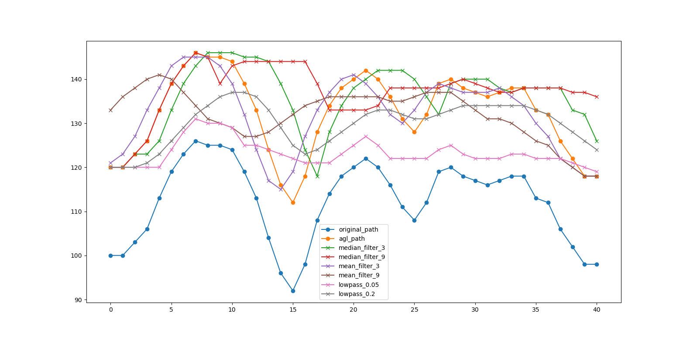

# drone-path-planning

Drone path planning exercise for debugging drone algorithms.

## Dependencies 

This project uses standard C++ 14. To build you will need to install `cmake`:

* [CMake](https://cmake.org/download/)

## Build

```bash
$ cd ./drone-path-planning
$ mkdir ./build
$ cd ./build
$ cmake ..
```

### Building and running on Windows

The CMake project will generate a solution file you can use to debug in Visual 
Studio or just open the folder with VS Code. To run tests:

```bash
$ ctest -C Debug 
```

### Building and running on Linux

From the `build` directory

```bash
$ make test
```

### Analyzing Data

There is a test in the `path_planner_test.cc` named `filter_larger_path()` that 
will apply several filters to the elevation profile output by the path planner.
The output is `filter_large_path.json` in the form:

```json
[
    {
        "name": <path_name>,
        "path": [...]
    },
    ...
]
```

There is also a small python script that produces plots for each of the paths
in file. The legend shows the `"name"` of each plot which consist of the 
original elevation along the path and the above-ground-level elevation. Each
of the filter paths from the test are also shown:



There's an `environment.yml` file that can be used to install the dependencies
necessary for plotting the path. This can be installed using 
[Miniconda](https://docs.conda.io/en/latest/miniconda.html):

```bash
$ conda env create -f ./environment.yml
```

To run the plotter from the root directory just:

```bash
$ python ./tests/plot_data.py --data ./filter_large_path.json
```